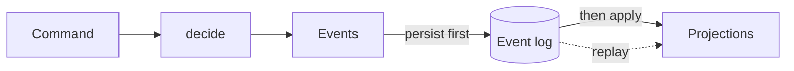

# Paper Trading Challenge

Backend service for a paper trading competition: order management against a mock
broker, per-participant portfolio and P&L tracking, and deterministic daily and
overall rankings.

**Rust workspace · Axum HTTP · SQLite event log · long-only equities.**
98 tests; `./scripts/check.sh` runs fmt, `clippy -D warnings` and the suite.

```bash
cargo run --bin ptc-demo     # a full two-day competition, start to finish
```

> This README is the brief overview it was asked to be. The full treatment lives
> in [`docs/design.md`](docs/design.md) (architecture and every decision),
> [`docs/ranking.md`](docs/ranking.md) (ranking, with a worked example), and
> [`docs/decision-log.md`](docs/decision-log.md) (the dated ledger — each
> decision with the alternative it beat).

## Running it

A stable Rust toolchain (tested on 1.97). SQLite is bundled — nothing to install.

```bash
cargo test --workspace       # 98 tests
cargo run --bin ptc-demo     # scripted demo: seeded broker, fixed clock, reproducible
cargo run --bin ptc          # server on http://127.0.0.1:8080
```

| Env | Default | |
|---|---|---|
| `PTC_ADDR` | `127.0.0.1:8080` | listen address |
| `PTC_DB` | `ptc.sqlite` | event log; `:memory:` for an ephemeral run |
| `PTC_SEED` | `42` | broker RNG seed — same seed, same fills |
| `PTC_FEE_BPS` | `0` | commission, basis points of notional |
| `PTC_MAX_SLICES` | `3` | partial fills an order is split into |
| `PTC_SYMBOLS` | *(any)* | allowlist, e.g. `AAPL,MSFT` — others are `REJECTED` |
| `PTC_MAX_QTY` | *(none)* | size cap — larger orders are `REJECTED` |

```bash
curl -sX POST localhost:8080/participants -H 'content-type: application/json' \
  -d '{"id":"alice","startingCash":"100000"}'
curl -sX POST localhost:8080/orders -H 'content-type: application/json' \
  -d '{"participant":"alice","symbol":"AAPL","side":"buy","qty":100,"limitPx":"10"}'
curl -sX POST localhost:8080/broker/executions -H 'content-type: application/json' \
  -d '{"orderId":1}'                                    # broker picks the terms
curl -sX POST localhost:8080/market/prices -H 'content-type: application/json' \
  -d '[{"symbol":"AAPL","px":"12"}]'
curl -s  localhost:8080/participants/alice/portfolio
curl -sX POST localhost:8080/days/2026-08-28/close
curl -s  localhost:8080/ladder
```

A Vue cockpit lives in [`ui/`](ui/README.md). It is **beyond the brief** — *"no
user interface is required"* — built after the scored work, and the service is
complete with the directory deleted.

## Architecture

```
crates/
  domain/    value types, order lifecycle, position + P&L fold   PURE — no I/O
  broker/    mock broker: seeded, deterministic execution reports
  scoring/   daily results, leaderboard, ladder                  PURE — no I/O
  engine/    command -> decide -> events -> apply
  store/     SQLite append-only event log + replay
  api/       App (engine + log), Axum HTTP, `ptc` server, `ptc-demo` CLI
```



**Dependencies point inward, and it is a compile error when they do not** — a
crate cannot import what is not in its `Cargo.toml`. That is why these are
crates rather than modules. `domain`'s entire dependency tree is `chrono` and
`thiserror`, with `chrono`'s `clock` feature switched off, so **`Utc::now()`
does not compile inside the domain**. Verified, not asserted.

## Key design decisions

**The execution report is the source of truth.** Positions, cash and P&L are
folds over an append-only event log, never beliefs maintained alongside it. Two
copies of one fact are permitted to disagree, and given time they will — that is
the bug class this removes. It also makes **replay a test**: rebuilding from the
log must reproduce state exactly, and the tests do it with a broker on a
*different seed*, which only passes because replay never consults it.

**Money is exact.** `Money`, `Px` and `Qty` are `i64` newtypes; `Money` and `Px`
share one 4-dp scale and `Qty` is unscaled, so `notional = px × qty` is an exact
multiply — no division, so no rounding in the core. On a cents scale,
`$10.0050 × 1 share` is 1000.5 cents: storable only by rounding, on every fill.
Money crosses the wire as decimal **strings**, because a JSON number is a double.

**Illegal states are unrepresentable; illegal transitions are rejected.** The six
states are an enum where each variant carries exactly its own data. Transitions
are a total function with **no wildcard arm**, so adding a state or event is a
compile error — verified by adding one. A fill on a terminal order is an error,
not a warning: it is a P&L bug that surfaces days later otherwise.

**Two order ids, because FIX has two.** `ClientOrderId` is ours, minted before
submission (`ClOrdID`, tag 11); `BrokerOrderId` is the broker's (tag 37).
Load-bearing, not ceremonial: executions are driven separately from submission,
so an order really does sit in `NEW` with no broker id, and cancelling there
needs an id we minted.

**Replace is cancel-replace.** Replacing an order 40/100 filled withdraws the
residual 60; the 40 stays booked on the original, and the replacement carries a
`replaces` link (`OrigClOrdID`, tag 41). A replace that loses the race to a fill
is rejected **naming the terminal state**, not turned into a second position.

**Pre-trade reservations are derived, never cached.** Available cash is the
balance minus the notional of working buy orders, recomputed each time. Without
it two orders both pass at submit and the second fails deep in the book at fill
time — far too late.

**Events are durable before they are visible:** plan → persist → apply.

**Fail closed, and strictly parsed.** A held symbol with no mark cannot be
valued, so closing a day is refused rather than publishing a book worth zero
(the *portfolio read* still answers, with `totalValue: null` and the missing
symbol named — fail closed means never a wrong number, not never a response).
`10.123456` is rejected rather than truncated; `aapl` rejected rather than
upper-cased, because two spellings of one key file executions twice.

## P&L

Long-only: average cost, realized on sell.

```
buy  q @ p, fee f:   cash −= q·p + f ; cost += q·p + f ; qty += q
sell q @ p, fee f:   removed   = cost · q / qty
                     realized += q·p − removed − f ; cash += q·p − f
                     cost     −= removed ; qty −= q
```

- **Unrealized** = `qty·mark − cost`, not `qty·(mark − avg)` — identical
  algebraically, but the second needs a division. **Total value** = `cash + Σ(qty × mark)`.
- **Average cost is never stored**, only `qty` and `cost`; the average is derived
  for display. A stored rounded average drifts. Tests pin it: buy 100 @ 10 then
  100 @ 12 gives 11.05, and **selling 50 leaves it at 11.05**.
- **Fees capitalised on buy, expensed on sell** — one convention, both sides.
- **Partial sales cannot accumulate residue**: a final sale has `sold == held`,
  so that division is exact. Tested on a basis that divides badly, closing to
  exactly zero.
- **Daily P&L** = today's close − yesterday's, not the sum of realized P&L, which
  would ignore mark-to-market on open positions.

## Ranking

The brief leaves this open and asks for **deterministic and fair**. Reasoning and
a worked example: [`docs/ranking.md`](docs/ranking.md).

**Daily board — ranked on return %**, not absolute P&L, which ranks the largest
account the moment capital differs.

| Key | | Why |
|---|---|---|
| daily return % | desc | the result |
| **turnover** | **asc** | the same return on less trading is the better result |
| `participantId` | asc | **total-order guarantee** |

The last key is arbitrary and openly so: its job is determinism, not fairness.
No two participants can compare equal, so the ranking cannot permute between
runs — asserted by ranking three input orderings of a tied day.

**Ladder — the geometric compound**, `Π(1 + rᵢ) − 1`. Over cumulative P&L (can be
bought with size) and over summing returns, which is simply wrong: −50% then
+50% sums to zero but leaves you down 25%. Ranking points are computed and shown
as a **secondary column**; they reward consistency but discard magnitude.

**Inactive.** An inactive *day* ranks normally at 0% — being flat is a real
decision, and on a down day it wins. But **ladder placement needs one active
day**: a participant who never traded is listed `rank: null, eligible: false`.
The line is between *choosing to be flat* and *never having competed*. Without
it, an account that never places an order tops the ladder in a falling market.

## API

RFC 7807 `problem+json` errors with stable `type`s, carrying the numbers that
explain them.

| | |
|---|---|
| `POST`/`GET` `/participants` · `GET /participants/{id}/portfolio` · `/orders` | create, list, read |
| `POST /orders` · `DELETE`/`PUT`/`GET /orders/{id}` | submit, cancel, replace, read |
| `POST /broker/executions` | generate an execution; omit `qty`/`px` to let the broker choose |
| `POST /market/prices` | update marks |
| `POST /days/{day}/close` · `GET /days/{day}/leaderboard` · `GET /days` · `GET /ladder` | competition |

An illegal transition returns `409` **naming the current state** — "it is already
`FILLED`" is actionable where "that failed" is not. Leaderboard and ladder
payloads state their own ranking rules, so a consumer never infers them.

## Testing

98 tests. `domain` and `scoring` hold no I/O, so the scored logic is tested
without a server; integration tests then prove it composes.

The **full 6 × 4 state/event matrix** with a length assertion so a new pair
cannot escape coverage · exhaustiveness verified by adding a variant and
confirming `E0004` · partials, overfill, empty fill, fill-on-terminal · cancel
before ack, cancel keeping fills, replace preserving them, replace losing the
race · a hand-computed buy → buy → sell → buy with fees, and
`total = starting + realized + unrealized` as an invariant · the worked example
from `ranking.md` executed · shuffled input producing identical rankings ·
replay through SQLite with a different broker seed · every endpoint · two demo
runs diffed byte for byte.

## Assumptions and limitations

Decisions, not gaps. Long-only equities, one currency, no leverage · whole
shares · marketable-limit fills only, so no book, queue position or price
improvement · money exact at 4 dp with no settlement rounding · a trading day is
whatever the operator closes, with no exchange calendar, and resting orders
carry over · participants assumed to start together with equal capital · no
deposits or withdrawals after creation · no auth or rate limiting · **ranking
rules are code**, so a `DayClosed` event stores the day's *facts* and the board
is recomputed from them — but changing the rules would change historical boards ·
one process, state rebuilt by replaying the log at startup.

## What would change for production

**Concurrency** — one mutex serialises every command, which is the single-writer
principle in its simplest form and right at this volume; next is a
channel-and-actor so reads never block writes, then partitioning by participant.
**A real venue** — a FIX adapter makes acks asynchronous and unreliable, forcing
timeouts, retries with idempotency keys and an orphan sweep, the part of a real
OMS this legitimately omits. **Storage** — Postgres, log partitioned by date,
projections checkpointed rather than replayed from zero. **The port boundary** —
`EventLog` should be defined *in* `engine` and implemented by `store`; today
`store` defines it, which is why `App` lives in `api`. **Market data** from a
real feed with staleness bounds. **Day close** as a scheduled job against an
exchange calendar. **Ranking migrations**, so a rules change cannot alter
published boards. **Auth, rate limits, observability.**

---

`CLAUDE.md` and `.claude/` hold the working agreements this was built under,
including the naming rule — every domain name traces to the brief, then to FIX,
then to a standard pattern, with a traceability table.

[`docs/decision-log.md`](docs/decision-log.md) includes the places the
implementation proved the design wrong: the money scale was specified in cents
until that turned out to make notional inexact; the concurrency section
specified an actor until a mutex proved to give the same ordering for far less;
and the dependency table contained a cycle. Showing where a design was corrected
is more useful than implying it was right first time.

AI assistance was used, which the brief permits. Every line has been reviewed and
is explainable.
