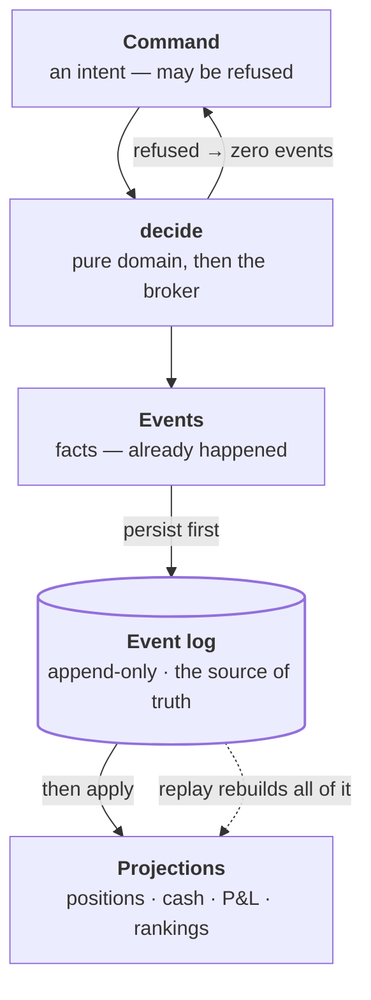
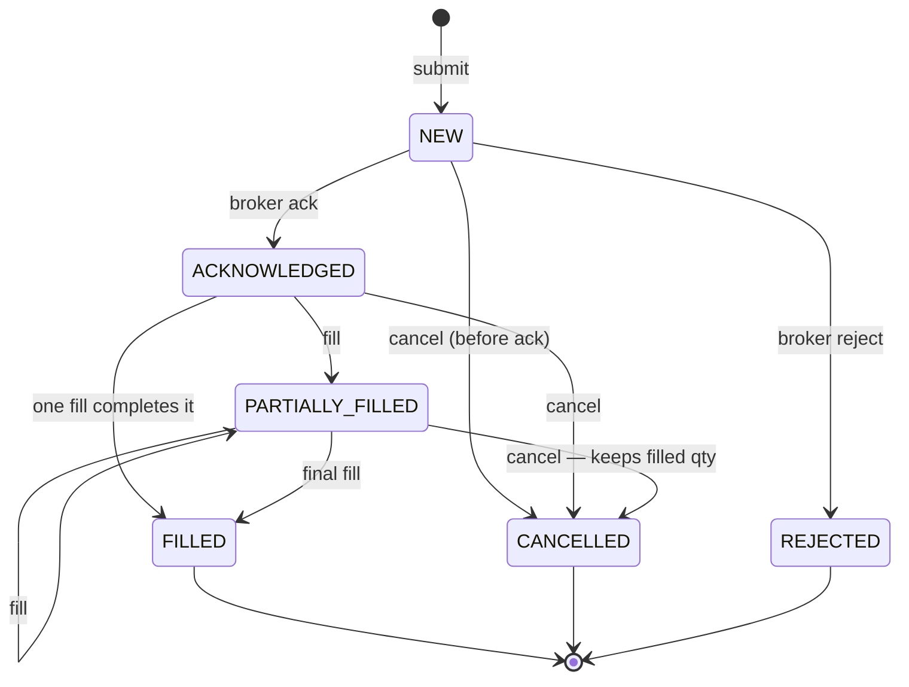

# System design

> Design doc, 2026-08-28. Written before code. The brief (`.claude/challenge.md`)
> leaves architecture, storage, concurrency and ranking open — this is our answer
> to each, with the alternative it was chosen over. Ranking has its own file:
> [`ranking.md`](ranking.md).

## 1. Shape

A single Rust process serving an Axum HTTP API over an in-memory domain backed
by an append-only SQLite event log. A mock broker runs inside the same process
and emits execution reports. A Vue cockpit consumes the API. Long-only equities,
one currency, no leverage — the simplifications the brief permits.



Read the two labelled edges together: **persist first, then apply**. Applying
before persisting would leave state the log cannot reproduce if the process died
in between — which is the divergence the log exists to prevent.

Everything a participant can observe — orders, positions, cash, P&L, rankings —
is a **projection of the event log**. Nothing is maintained alongside it.

## 2. The one rule: the execution report is the source of truth

The single hardest-won lesson from running live order management is that the
whole class of position bugs comes from **two copies of the same fact being
allowed to disagree**: an inferred position belief, reconciled against the
venue, halting or drifting when they diverge. Missed fill → phantom position.
Duplicate fill → double-counted P&L.

So: the broker's execution report is authoritative, and position, cash, average
cost and P&L are **folds over the event stream**, computed, never stored as an
independently-updated belief. In a paper trading system the mock broker *is* the
venue, which makes this cheap to do properly — there is no excuse for inferring
a position we were told.

Consequences that fall out for free:

- **Replay is a test.** Rebuilding projections from the log must reproduce state
  exactly. Any accidental hidden state fails that test immediately.
- **Idempotency is structural.** Events carry `(client_order_id, seq)`; a
  re-delivered execution report is a no-op rather than a double fill.
- **Audit is free.** "Why does this participant hold 300 shares" is answered by
  reading their events, not by reasoning forward through handler code.

**Rejected alternative:** mutable `Position` rows updated in place by each fill.
Less code on day one, and it is the exact shape that produces silent
divergence — the bug that only appears once the numbers are large enough to
matter and too late to reconstruct.

## 3. Money

| Quantity | Representation | Why |
|---|---|---|
| Cash balance, notional, fee, P&L | `i64` at a shared scale of 1e4, in a `Money` newtype | Exact. A float cent error compounds across a competition and cannot be reconciled afterwards |
| Price | `i64` at the **same** 1e4 scale, in a `Px` newtype | One shared scale means `notional = px.raw × qty` — an exact multiply with **no division and so no rounding** anywhere in the core. On a cents scale, `$10.0050 × 1` is 1000.5 cents and could only be stored by rounding, on every fill, silently |
| Quantity | `i64` whole shares in a `Qty` newtype | Long-only equities; no fractional shares (assumption) |
| Average cost | rational: `total_cost: i64` / `total_qty: i64` | Divided only for display. Storing a *rounded* average and re-multiplying drifts |
| Return % | `Decimal` computed once at day close, from integer inputs | Presentation-layer only; never feeds another calculation |

JSON carries money as decimal **strings**. A JSON number is an IEEE double and
`0.1 + 0.2` is where money goes missing. Parsing is strict — `1.23456` is
rejected rather than truncated (`.claude/principles.md` §7).

Settlement rounding to a real currency's minor unit is deliberately not
modelled; it is a production concern (§16).

## 4. Order lifecycle

States are exactly those the brief names. Transitions are an explicit table;
anything unlisted is rejected and leaves state untouched.



`NEW --> CANCELLED` is the window our own order id exists for: the order is live
at our end and the broker has not given us an id yet.

| From | Event | To |
|---|---|---|
| — | submit | `NEW` |
| `NEW` | broker ack | `ACKNOWLEDGED` |
| `NEW` | broker reject | `REJECTED` |
| `NEW` | cancel | `CANCELLED` *(cancel-before-ack — see below)* |
| `ACKNOWLEDGED` | partial fill | `PARTIALLY_FILLED` |
| `ACKNOWLEDGED` | full fill | `FILLED` |
| `ACKNOWLEDGED` | cancel | `CANCELLED` |
| `PARTIALLY_FILLED` | partial fill | `PARTIALLY_FILLED` |
| `PARTIALLY_FILLED` | final fill | `FILLED` |
| `PARTIALLY_FILLED` | cancel | `CANCELLED` *(retains `filled_qty`)* |

`FILLED`, `CANCELLED`, `REJECTED` are terminal. A fill arriving on a terminal
order is an error, not a warning — it is a P&L bug that would otherwise surface
days later during reconciliation.

**Two ids.** `client_order_id` is minted the instant we decide to submit,
*before* the broker acks. `broker_order_id` is recorded when known. That map is
what makes two things possible that a broker-id-keyed design cannot do:

- **cancel an un-acked order** — there is a real window between submit and ack,
  and "you can't cancel yet" is not an acceptable answer in it;
- **correlate a fill when the ack races the execution report** — the fill
  carries our id, so it is never dropped for lack of a broker id.

## 5. Replace

Replace is **cancel-replace**, not in-place mutation: the original order moves
to `CANCELLED`, a new order is minted with a new `client_order_id` and a
`replaces` link to the old one. Rules:

- **Filled quantity is never rewritten.** Replacing an order that is 40/100
  filled cancels the residual 60 and creates a new order for the requested
  quantity. The 40 stays booked against the original.
- **A replace can lose the race.** If the order fills completely before the
  replace is processed, the replace is rejected — `FILLED` is terminal. The API
  returns the terminal state so the caller can decide, rather than silently
  creating an unwanted second order.
- **Chain is preserved.** `replaces` makes the full history reconstructable,
  which matters because a leaderboard is downstream of it.

**Rejected alternative:** mutating price/qty on the existing order. Simpler
until an execution report arrives referencing the pre-modification terms, at
which point there is no record of what was actually working at the venue.

## 6. Mock broker

Deterministic and seeded — same seed produces the same execution reports, which
is what makes the test suite meaningful and the demo repeatable.

- **Explicit mode (default).** Executions are driven through the API:
  `POST /broker/executions` with quantity and price. Total control, used by
  every test.
- **Auto mode.** A seeded fill policy acks, then emits *n* partials to
  completion at or better than the limit price. `Rng` is passed in, never
  ambient — no `thread_rng` anywhere in the domain.
- **Reject policy.** Configurable triggers (unknown symbol, insufficient cash,
  size cap) exercise the `REJECTED` path.

Marketable-limit only. No book, no queue position, no price-time priority —
those are a different exercise and the brief does not ask for them.

## 7. Portfolio

Long-only, so the accounting is average-cost with realization on sell.

```
buy  qty q @ px p, fee f:   cash -= q*p + f
                            total_cost += q*p + f      (fees capitalised into basis)
                            total_qty  += q

sell qty q @ px p, fee f:   avg        = total_cost / total_qty     (rational)
                            realized  += q*(p - avg) - f
                            cash      += q*p - f
                            total_cost -= q*avg
                            total_qty  -= q
```

- **Unrealized** = `total_qty * (mark - avg)`, marks from the last price update.
- **Total portfolio value** = `cash + Σ(qty × mark)`.
- **Fees are capitalised into the basis on buy and expensed on sell.** One
  convention, applied consistently, documented — the trap is applying it on one
  side only, which leaks a fee per round trip.
- **No mark, no value.** Holding a symbol with no price update yet is an error at
  day close, not a silent zero. Fail closed: a wrong portfolio value corrupts a
  leaderboard that is then immutable.

Short positions are out of scope (the brief permits this). `total_qty` may not
go negative; a sell exceeding the position is `REJECTED` at submit.

## 8. Closing a day

A day close is a **snapshot, and it is immutable once written**.

1. Assert every held symbol has a mark. Fail closed otherwise.
2. Compute per participant: closing portfolio value, daily P&L, daily return %.
3. Write an immutable `daily_result` row per participant.
4. Compute and store the daily leaderboard and the updated overall ladder.

Rules, each one a decision:

- **Idempotent.** Re-closing a closed day returns the existing snapshot rather
  than recomputing. Rankings are published; recomputation is how a published
  result silently changes.
- **Resting orders carry over.** They are not cancelled at close — a working
  order is a position the participant intends to have, and cancelling it would
  be the system making a trading decision on their behalf.
- **Daily P&L = today's closing value − yesterday's closing value.** Not the sum
  of realized P&L, which ignores mark-to-market on open positions.
- **Day 1 baseline is the starting cash**, so a participant's first day is
  measured from what they were given.

## 9. Ranking

Full treatment in [`ranking.md`](ranking.md) — the brief calls out ranking as an
explicitly scored decision, so it gets its own document. Summary:

- **Daily leaderboard** ranks on **daily return %**, not absolute P&L, so
  participants with different capital compare fairly.
- **Overall ladder** is the **geometric compound of daily returns**, because
  returns chain multiplicatively and cumulative P&L can be bought with size.
- **Ties** resolve through a documented chain ending in `participant_id`, giving
  a **total order** — no two participants can compare equal, so ranking cannot
  permute between runs.
- **Inactive participants** rank normally at 0% but need at least one active day
  to be ladder-**eligible**, so a participant who never trades cannot win by
  standing still.

## 10. Layout

```
crates/
  domain/       Order, OrderState, Fill, Position, Money newtypes, the
                transition table, the position fold — pure, no async, no I/O
  broker/       mock broker: seeded fill policy, execution report generation
  scoring/      daily results, leaderboard, ladder — pure, no async, no I/O
  store/        SQLite append-only event log + projection rebuild
  api/          application assembly (`App`: engine + log + write-ahead),
                Axum HTTP and DTOs, the `ptc` server and the `ptc-demo` CLI
ui/             Vue 3 + TS + Vite cockpit — beyond the brief, see README
tests/          integration: full trading day, replay determinism
```

`domain` and `scoring` are the scored content and hold no I/O — they are unit
testable without standing up a server. If a rule needs a running server to test,
it is in the wrong crate.

## 11. API

| Method | Path | Purpose |
|---|---|---|
| `POST` | `/participants` | create, with starting cash |
| `GET` | `/participants/{id}/portfolio` | cash, positions, avg price, realized/unrealized, total value |
| `GET` | `/participants/{id}/orders` | active + historical, filterable by state |
| `POST` | `/orders` | submit → `NEW` |
| `DELETE` | `/orders/{id}` | cancel |
| `PUT` | `/orders/{id}` | replace (cancel-replace, returns the new id) |
| `POST` | `/broker/executions` | drive a mock execution report |
| `POST` | `/market/prices` | update marks (batch) |
| `POST` | `/days/{date}/close` | close a trading day (idempotent) |
| `GET` | `/days/{date}/leaderboard` | daily leaderboard |
| `GET` | `/ladder` | overall competition ladder |

Errors are RFC 7807 problem+json with a stable machine-readable `type`. An
illegal state transition is `409 Conflict` carrying the current state — the
caller needs to know what it actually is, not merely that it failed.

## 12. Concurrency

**A single writer: one mutex around the whole application.** Every command and
every read takes it, so mutations form one total order and no read sees a
half-applied command.

The property that matters here is **ordering, not throughput** — "same input,
same leaderboard" has to be something we test, not something we hope for.
Interleaved writers would make that impossible.

*This section originally specified a channel-and-actor.* The implementation
used a mutex instead: it delivers the identical ordering property with a
fraction of the machinery, and a competition's order volume is nowhere near one
core. Building the actor anyway would be the speculative complexity
`principles.md` §7 declines. The actor is the right answer when readers must not
block writers — which is a real matching engine, not this — and it is listed as
a production delta in §16.

## 13. Storage

SQLite, append-only `events` table, projections rebuilt by replaying on boot.
The event log is the database; everything else is a cache of it.

Chosen over an ORM with mutable rows for the reason in §2, and over pure
in-memory because durability across a restart costs one table here and makes
replay-determinism testable. Not chosen: Postgres, which buys nothing an
interview exercise can demonstrate.

## 14. Testing

Unit tests carry the argument; integration tests prove it composes. The flows
the brief names, each a test:

- submit → ack, and every illegal transition rejected from every state
- partial fills accumulating; final fill closing to `FILLED`
- cancel from `NEW` (pre-ack) and from `PARTIALLY_FILLED`, retaining `filled_qty`
- replace: residual cancelled, filled qty preserved, and losing the race to a fill
- average cost across buy → buy → sell → buy, with fees on both sides
- realized vs unrealized separation; total value against a hand-computed figure
- day close: idempotency, missing-mark failure, carry-over of resting orders
- leaderboard ordering, every tiebreak level, and inactive-participant handling
- **determinism**: shuffled input produces identical ranking
- **replay**: rebuilt projections equal live projections, field for field

## 15. Not building

Deliberate omissions, each stated in the README so they read as decisions rather
than gaps: shorts and margin · an order book with price-time priority · limit
order resting against a live market · multi-currency · corporate actions ·
authentication · rate limiting · horizontal scale.

## 16. Production delta

For the README's "what would change for production" section:

- Single mutex → a channel-and-actor so reads never block writes, then
  partitioned by participant, or an event bus with per-participant ordering
  guarantees.
- Ranking rules are code, so changing them changes historical leaderboards. A
  `DayClosed` event stores the day's *facts* and the board is recomputed from
  them; in production a rules change needs a migration that freezes already
  published boards.
- SQLite → Postgres with the event log partitioned by date; projections
  materialised rather than replayed from zero at boot.
- Mock broker → a real venue adapter (FIX or REST), which makes acks
  asynchronous and unreliable and forces timeouts, retries with idempotency
  keys, and an orphan-order sweep — the part of a real OMS this exercise
  legitimately omits.
- Marks from a real feed, with staleness bounds and a halt on unreadable data.
- Day close becomes a scheduled job with an exchange calendar, holidays, and a
  settlement cycle rather than a manual endpoint.
- Auth, per-participant rate limits, and an audit trail on every mutation.
